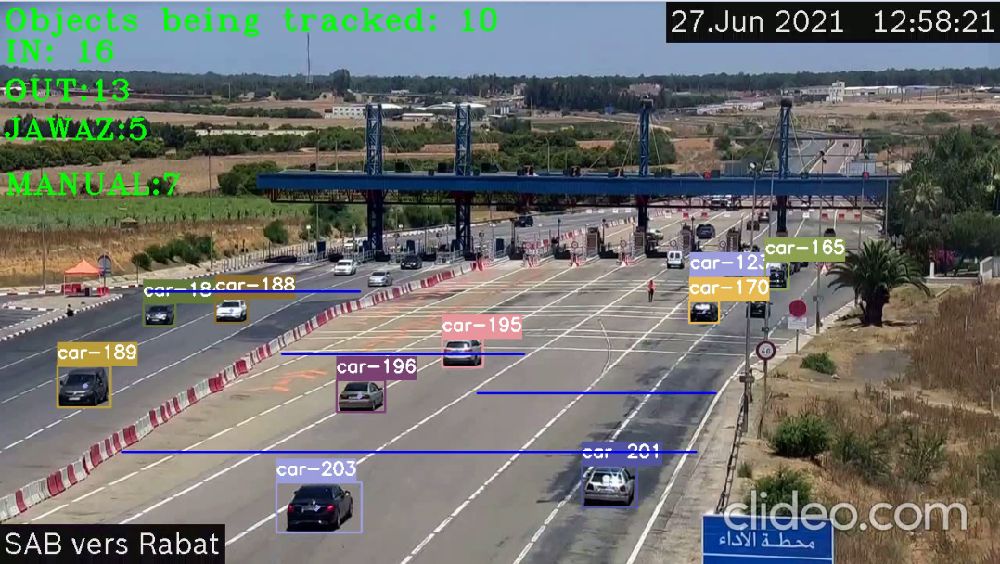

# yolov4-deepsort-tensorflow-for-counting-vehicles-in-4-zones
[](https://colab.research.google.com/drive/1tSDUSZP5Gh2Pe355j-cACTQjbHfaLmE2?usp=sharing)

Suivi d'objets implémenté avec YOLOv4, DeepSort et TensorFlow. YOLOv4 est un algorithme de pointe qui utilise des réseaux de neurones convolutifs profonds pour effectuer des détections d'objets. Nous pouvons utiliser la sortie de YOLOv4, c'est-à-dire, les détections pour alimenter ces détections d'objets dans Deep SORT (Simple Online and Realtime Tracking with a Deep Association Metric) afin de créer un modèle capable de compter les véhicules à partir des vidéos d'une manière très précise.

## détection et comptage à partir d'une vidéo
<p align="center"></p>

## Pour commencer le projet
Pour commencer, installez les dépendances appropriées via Anaconda ou Pip. 

### Pip
(Les packages TensorFlow 2 nécessitent une version pip > 19.0.)
```bash
# TensorFlow CPU
pip install -r requirements.txt

# TensorFlow GPU
pip install -r requirements-gpu.txt
```

## Télécharger les poids pré-entraînés officiels YOLOv4
Notre traqueur d'objets utilise YOLOv4 pour effectuer les détections d'objets, que Deep SORT utilise ensuite pour suivre les véhicules. Il existe un modèle officiel de détection d'objets YOLOv4 pré-entraîné capable de détecter 80 classes. Pour notre projet, nous allons utiliser les poids pré-entraînés pour notre tracker vu que les classes sur lesquelles reposent ce projet sont disponible au niveau de la base de données COCO.
Télécharger les poids de YOLOV4 à partir du repository officiel (L'un des créateurs de YOLOV4) : https://github.com/AlexeyAB/darknet/releases/download/darknet_yolo_v3_optimal/yolov4.weights
Ou les télécharger à partir de ce fichier : https://drive.google.com/open?id=1cewMfusmPjYWbrnuJRuKhPMwRe_b9PaT

Copiez et collez yolov4.weights de votre dossier de téléchargements dans le dossier « data » de ce référentiel.

Si vous souhaitez utiliser yolov4-tiny.weights, un modèle plus petit qui est plus rapide pour exécuter les détections mais moins précis, téléchargez le fichier ici : https://github.com/AlexeyAB/darknet/releases/download/darknet_yolo_v4_pre/yolov4-tiny.weights

## Exécuter notre Détecteur-traqueur avec YOLOv4
Pour implémenter le suivi d'objet à l'aide de YOLOv4, nous convertissons d'abord les poids dans le modèle TensorFlow correspondant qui sera enregistré dans un dossier checkpoints. Ensuite, tout ce que nous avons à faire est d'exécuter le script object_tracker.py pour exécuter notre calcul d'objets avec YOLOv4, DeepSort et TensorFlow.

```bash
# Convert darknet weights to tensorflow model
python save_model.py --model yolov4 

# Run yolov4 deep sort object tracker on video
python object_tracker.py --video ./data/video/27-06-2021_3.mkv --output ./outputs/demo.avi --model yolov4 --count --output_data ./outputs/sheet1.xlsx

```
Le Flag 'output' nous permet d'enregistrer la vidéo résultante du suivi d'objet en cours d'exécution afin que nous puissions la revoir plus tard. La vidéo sera enregistrée dans le chemin que nous avons défini. (le dossier 'outputs' est l'endroit où il se trouvera si nous exécutons la commande ci-dessus!)

## Exécuter le Tracker avec YOLOv4-Tiny
Les commandes suivantes vous permettront d'exécuter le modèle yolov4-tiny. Yolov4-tiny vous permet d'obtenir une vitesse plus élevée (FPS) pour le tracker à un léger coût de précision. 
```
# save yolov4-tiny model
python save_model.py --weights ./data/yolov4-tiny.weights --output ./checkpoints/yolov4-tiny-416 --model yolov4 --tiny 

# Run yolov4-tiny object tracker
python object_tracker.py --weights ./checkpoints/yolov4-tiny-416 --model yolov4 --video ./data/video/test.mp4 --output ./outputs/tiny.avi --tiny --count --output_data ./outputs/sheet1.xlsx
```

## Vidéo résultante
Comme mentionné ci-dessus, la vidéo résultante sera enregistrée à l'endroit où nous définissons le chemin du Flag de ligne de commande --output. Je l'ai toujours configuré pour qu'il soit enregistré dans le dossier « outputs ». Nous pouvons également modifier le type de vidéo enregistrée en ajustant le flag --output_format, par défaut, il est défini sur le codec AVI qui est XVID.


## Personnaliser les classes à détecter par le tracker 
Par défaut, le code est configuré pour détecter et suivre les 80 classes disponibles dans l'ensemble de données COCO, le modèle YOLOv4 pré-entraîné est entraîné sur ces 80 classes. Cependant, nous pouvons facilement ajuster le code afin de suivre une ou les clasees de notre choix et dont nous aurons besoin. 

Pour filtrer une sélection personnalisée de classes, il vous suffit de commenter la ligne 221 et de décommenter la ligne 224 de [object_tracker.py] Dans la liste ``allowed_classes``, ajoutez simplement les classes que vous souhaitez que le tracker suive. Les classes peuvent être n'importe laquelle des 80 sur lesquelles le modèle est entraîné, voyez quelles classes vous pouvez suivre dans le fichier [data/classes/coco.names]

## Personnaliser les zones de comptage
Vous pouvez changer les paramètres des lignes à tracer et des zones dont le calcul des véhicules sera pris en considération en modifiant les paramètres des lignes (144,145,146,147) du fichier 
[object_tracker.py]. Nous pouvons ajouter d'autres zones et d'autres forme sans jamais oublier de les ajouter au niveau des conditions d'intersection commençant à partir de la ligne 321 du fichier 
[object_tracker.py].

## Référence des arguments de ligne de commande

```bash
save_model.py:
  --weights: chemin au fichier des poids
    (default: './data/yolov4.weights')
  --output: chamin de la sortie
    (default: './checkpoints/yolov4-416')
  --[no]tiny: yolov4 ou yolov4-tiny
    (default: 'False')
  --input_size: définir la taille du input du modèle d exportation
    (default: 416)
  --model: yolov3 ou yolov4
    (default: yolov4)
    
 object_tracker.py:
  --video: path to input video
    (default: './data/video/test.mp4')
  --output: path to output video 
    (default: None)
  --output_format: codec used in VideoWriter when saving video to file
    (default: 'XVID)
  --[no]tiny: yolov4 or yolov4-tiny
    (default: 'false')
  --weights: path to weights file
    (default: './checkpoints/yolov4-416')
  --framework: what framework to use (tf, trt, tflite)
    (default: tf)
  --model: yolov3 or yolov4
    (default: yolov4)
  --size: resize images to
    (default: 416)
  --iou: iou threshold
    (default: 0.45)
  --score: confidence threshold
    (default: 0.50)
  --dont_show: dont show video output
    (default: False)
  --info: print detailed info about tracked objects
    (default: False)
  --count: count number of vehicles tracked per frame
    (default: False)
  --output_data: extract counting data in a Excel folder
    (default: False)
```

### References  

   Huge shoutout goes to the creators of this projets for creating the backbones of this repository:
  * [tensorflow-yolov4-tflite](https://github.com/hunglc007/tensorflow-yolov4-tflite)
  * [Deep SORT Repository](https://github.com/nwojke/deep_sort)
  * [YOLOV4-Tensorflow Repository](https://github.com/theAIGuysCode/tensorflow-yolov4-tflite)
  * [YOLOV4-Deep SORT Tensorflow Repository](https://github.com/theAIGuysCode/yolov4-deepsort)
  * [Event Driven Pedestrian Vehicle Detection with OpenCV and Yolo](https://github.com/akshayjoshii/Event-Driven-Pedestrian-Vehicle-Detection)
  * [Python Traffic Counter](https://github.com/HodenX/python-traffic-counter-with-yolo-and-sort)
